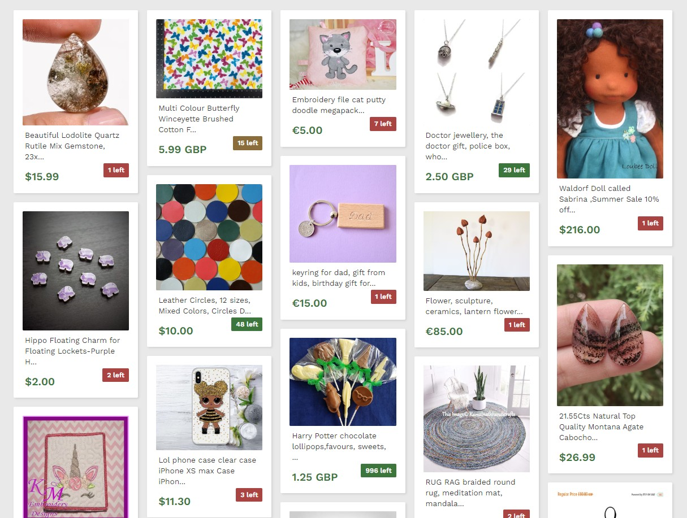

# Список предложений

Учебный проект курса [React для JS-разработчиков](https://netology.ru/programs/react)

## **Задача**

Вывод списка предложений каталога Etsy.com, с использованием библиотеки React.

## **Описание компонента**

Для отображения списка создан компонент `Listing`, который принимает следующие атрибуты:

`items` — список предложений, массив объектов, по умолчанию пустой массив.
Компонент должен создавать на основе списка предложений следующий HTML-код:

```JavaScript
<div class="item-list">
  <div class="item">
    <div class="item-image">
      <a href="https://www.etsy.com/listing/292754135/woodland-fairy">
        
      </a>
    </div>
    <div class="item-details">
      <p class="item-title">Woodland Fairy</p>
      <p class="item-price">$3.99</p>
      <p class="item-quantity level-medium">12 left</p>
    </div>
  </div>
</div>
```

Если название предложения превышает `50` символов, то выводятся только первые `50` символов, и добавлять символ `…` в конце.

При выводе стоимости предложения необходимо учитывать валюту. Если цена задана:

* в долларах США, код `USD`, то цену вывести в формате `$50.00`;
* в евро, код `EUR`, то цену вывести в формате `€50.00`;
* в остальных случаях цену вывести в формате `50.00 GBP`, где `GBP` — код валюты.

Вывести остаток, подсветив его в зависимости от количества, используя класс `level-*`:

* `level-low` — если остаток меньше 10 включительно;
* `level-medium` — если остаток меньше 20 включительно;
* `level-high` — если остаток больше 20.
## **Стек технологий**


## [**Демо**](https://listing-tau.vercel.app/)
